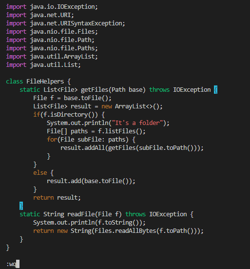

# **LAB REPORT: VIM**

### In this lab report, we will be going over `vim` commands and their uses, demonstrated by performing one lab task from [Week 6](https://ucsd-cse15l-f22.github.io/week/week6/).

---

## **PART 1: CHANGING THE NAME OF THE `start` PARAMETER AND ITS USES TO `base`**

- **Vim Keystroke Sequence**: 

    * vim DocSearchServer.java `<Enter>`
    * /start `<Enter>`
    * cgn base `<Esc>`
    * n . n . 
    * :wq `<Enter>`

1) When starting up DocSearchServer.java in `vim`, the cursor will be directly at the top left of the file, highlighting the very first character: 
    * TRACING KEYSTROKES: 
        * *vim* *DocSearchServer.java* *`<Enter>`*

2) We then type **/start** `<Enter>` in order for the cursor to jump to the first occurrence of the word "start," as demonstrated in this screenshot: 
* TRACING KEYSTROKES: 
    * */start* *`<Enter>`*
    

3) Now, we should type **cgn base** first, which will make `vim` go into **Insert** mode, delete the highlighted word ("start") and will let us replace it with something else. In this case, we will type "base," and we press the `<Esc>` key to return to normal mode, as shown below: 

* TRACING KEYSTROKES: 
    * Typing *cgn*
    
    
    
    * Typing *base*

    

    * OUTPUT: 

    

4) Following this, we can press **n** to find the next instance of the word "start," and right after we can press **.** to do the exact same thing that we just did in the previous step, which is deleting the word and replacing it with "base"--this **.** command will do the very last thing that we have done. 

* TRACING KEYSTROKES: 

    * Pressing *n* once

        

    * Pressing *.* once 

        

5) Now, we just keep repeating the above step until we cover every instance of the word "start"

* TRACING KEYSTROKES: 
    
    * Pressing *n* once

        

    * Pressing *.* once

        

    * Note: if we press **n** again to look for more instances of "start," we will see the following message: 

    

6) After all of this, we are done! Now we just need to save the file and exit `vim`. To do so, we press : w (to save) q (to quit)

* TRACING KEYSTROKES:
    * *:* *w* *q*

        
---

## **PART 2: `SCP` TEST (LOCAL VS. REMOTE), QUESTIONS** 

### **⮞ TESTS**
#### *LOCAL EDIT, `SCP` TO REMOTE*
* This test took me around 1:30 min to do, at most. I ran into a couple typos while typing out what directory I wanted the file to be `scp`'d into. Editing the file locally was also increased how long the total test took since I was not able to rely on `vim` for edits and special commands (which is what I did above).

#### *REMOTE EDIT WITH `VIM`*
* This test was much faster to compute than the last test, taking me around 40.15 seconds in total. Something that lowered this time was the fact that I had already used an `ssh` key, which saved time by not having to type out the password. 

### **⮞ QUESTIONS**

#### *1) Which of these two styles would you prefer using if you had to work on a program that you were running remotely, and why?*

- If I were working on a remotely ran program, I would prefer using `vim`, as I would be saving a lot of time by not having to `scp` the file back and forth (in a similar style to the first test computed above). Additionally, `vim` offers many useful commands to make changes to a file or program, which promotes its efficiency.
    * To summarize, I would choose `vim` for working on projects *remotely* due to its capability to save a lot of time and effort. 

#### *2) What about the project or task might factor into your decision one way or another? (If nothing would affect your decision, say so and why!)*

- What would affect my decision about which method to use would definitely be the size of the file (in terms of code) and/or how many files are within the project that I have to edit and debug thoroughly. In this case, I would prefer using some other editing software that I am extremely familiar and comfortable with, such as VS Code, since I would have a lot of flexibility. 
    * For example, I might want to highlight code to edit with my cursor, however if I'm using `vim` I would probably forget that I cannot use my cursor there but rather certain keys on the keyboard to move around. I feel like this would just make me waste more time since I am not completely familiarized with  `vim` enough to thoroughly edit a project. 
        * Perhaps in the future when I have more experience with `vim` I might choose to use it over any other software for its efficiency (as mentioned above). :)

